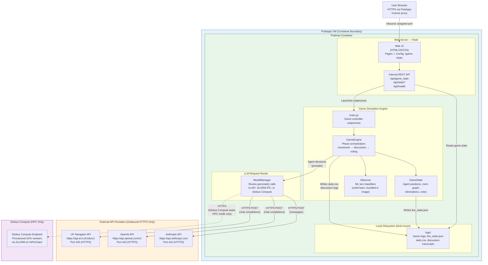
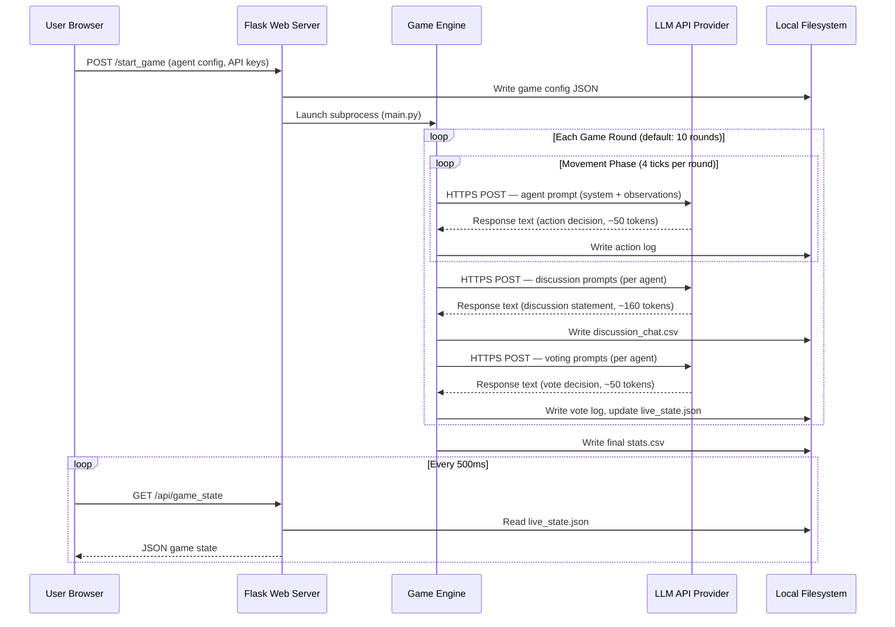

# Agents Among Us - System Architecture

**Prepared for:** UF Research Computing (RCOPS) and Information Security Office (ISO)
**Application Type:** Research web application (containerized)
**Deployment Target:** HiPerGator PubApps

---

## 1. Application Overview

Agents Among Us is a research platform for studying LLM behavior in multi-agent social deduction games. LLM-powered agents are assigned roles (honest or deceptive) and interact through structured game phases: movement, discussion, and voting. The application collects behavioral data (discussion transcripts, voting patterns, suspicion scores) for analysis.

The application is a **single-container web service** that makes **outbound HTTPS calls** to LLM API providers. It does not require a database, GPU, or any inbound connections other than its assigned PubApps port.

---

## 2. System Component Map

---

## 3. Network Connections (Complete Inventory)

### Inbound Connections

| Source | Destination | Port | Protocol | Purpose |
|--------|-------------|------|----------|---------|
| User browser | PubApps reverse proxy | 443 | HTTPS | Web UI access via `*.rc.ufl.edu` |
| PubApps proxy | Container | Assigned port | HTTP | Reverse-proxied to Flask app |

### Outbound Connections

| Source | Destination | FQDN | Port | Protocol | Purpose |
|--------|-------------|------|------|----------|---------|
| Container | UF Navigator | `api.ai.it.ufl.edu` | 443 | HTTPS | LLM inference requests |
| Container | OpenAI | `api.openai.com` | 443 | HTTPS | LLM inference requests |
| Container | Anthropic | `api.anthropic.com` | 443 | HTTPS | LLM inference requests |
| Controller | Globus Compute | `compute.api.globus.org` | 443 | HTTPS | Task submission and result retrieval (GLOBUS mode only) |
| Controller | Globus Auth | `auth.globus.org` | 443 | HTTPS | Endpoint authentication (GLOBUS mode only) |
| Endpoint | RabbitMQ | `*.compute.globus.org` | 5671 | AMQPS | Task/result transport for endpoint workers (GLOBUS mode only) |

**PubApps note:** The PubApps deployment uses API mode only and does not connect to Globus Compute. The Globus connections above apply only to HPC/SLURM deployments using the `GLOBUS` LLM mode. All data is stored on local filesystem within the bind-mounted `logs/` directory.

### Data Sent to External APIs

Each API call sends a single chat completion request containing:
- A **system prompt** describing the game scenario and the agent's role (~500 tokens)
- A **user prompt** containing the agent's current observations (room locations, other agents present, discussion history) (~200-800 tokens)
- The response is a short text output (~50-160 tokens): a movement decision, a discussion statement, or a vote

No personal data, user credentials, or sensitive information is sent. The prompts contain only fictional game scenarios with generated agent names and colors.

---

## 4. LLM Models — Inventory and Hosting

### API-Hosted Models (Used in PubApps Deployment)

These models are accessed via outbound HTTPS. No model weights are stored or executed locally.

#### UF Navigator (`api.ai.it.ufl.edu`) — Hosted by UF UFIT

Authenticated with `NAVIGATOR_TOOLKIT_API_KEY` (UF-issued). Navigator is UF's internal AI gateway that proxies requests to models hosted on UF infrastructure or licensed third-party endpoints.

| Model ID | Description |
|----------|-------------|
| `llama-3.3-70b-instruct` | Meta Llama 3.3 70B (hosted on UF infrastructure) |
| `gemma-3-27b-it` | Google Gemma 3 27B (hosted on UF infrastructure) |
| `mistral-small-3.1` | Mistral Small 3.1 (hosted on UF infrastructure) |
| `claude-4-sonnet` | Anthropic Claude Sonnet 4 (proxied via Navigator) |
| `gpt-4o` | OpenAI GPT-4o (proxied via Navigator) |
| `gemini-2.0-flash` | Google Gemini 2.0 Flash (proxied via Navigator) |

#### OpenAI (`api.openai.com`) — Hosted by OpenAI (US data centers)

Authenticated with `OPENAI_API_KEY`.

| Model ID | Description |
|----------|-------------|
| `gpt-4o` | GPT-4o |
| `gpt-4o-mini` | GPT-4o Mini |

#### Anthropic (`api.anthropic.com`) — Hosted by Anthropic (US data centers)

Authenticated with `ANTHROPIC_API_KEY`.

| Model ID | Description |
|----------|-------------|
| `claude-sonnet-4-20250514` | Claude Sonnet 4 |
| `claude-3-5-haiku-20241022` | Claude 3.5 Haiku |

### Locally-Loaded Models (HPC/SLURM Only — NOT Used in PubApps)

These models are only used when running on HiPerGator GPU nodes via SLURM batch jobs. They are downloaded from Hugging Face Hub and loaded into GPU VRAM. **None of these run in the PubApps deployment.**

| Weight Class | Model | Hugging Face ID | Parameters | VRAM Required |
|-------------|-------|-----------------|------------|---------------|
| Heavyweight | Llama 3.3 | `meta-llama/Llama-3.3-70B-Instruct` | 70B | ~40 GB (4-bit) |
| Heavyweight | Qwen 2.5 | `Qwen/Qwen2.5-72B-Instruct` | 72B | ~40 GB (4-bit) |
| Heavyweight | Qwen 3 | `Qwen/Qwen3-Next-80B-A3B-Instruct` | 80B (MoE) | ~40 GB (4-bit) |
| Heavyweight | Hermes 4 | `NousResearch/Hermes-4-70B` | 70B | ~40 GB (4-bit) |
| Heavyweight | Apertus 70B | `swiss-ai/Apertus-70B-Instruct-2509` | 70B | ~40 GB (4-bit) |
| Heavyweight | Arcee Nova | `arcee-ai/Arcee-Nova` | 73B | ~40 GB (4-bit) |
| Heavyweight | Athene V2 | `Nexusflow/Athene-V2-Chat` | 73B | ~40 GB (4-bit) |
| Heavyweight | HyperNova | `MultiverseComputingCAI/HyperNova-60B` | 60B | ~35 GB (MXFP4) |
| Heavyweight | Mixtral 8x7B | `Aratako/Mixtral-8x7B-Instruct-v0.1-upscaled` | 8x7B (MoE) | ~30 GB (4-bit) |
| Lightweight | Llama 3 | `meta-llama/Meta-Llama-3-8B-Instruct` | 8B | ~8 GB |
| Lightweight | Llama 3.1 | `meta-llama/Llama-3.1-8B-Instruct` | 8B | ~8 GB |
| Lightweight | Qwen 2 | `Qwen/Qwen2-7B-Instruct` | 7B | ~7 GB |
| Lightweight | Qwen 2.5 | `Qwen/Qwen2.5-7B-Instruct` | 7B | ~7 GB |
| Lightweight | Qwen 3 | `OpenPipe/Qwen3-14B-Instruct` | 14B | ~14 GB |
| Lightweight | Gemma 2 | `google/gemma-2-9b-it` | 9B | ~9 GB |
| Lightweight | OLMo 3 | `allenai/Olmo-3-7B-Instruct` | 7B | ~7 GB |
| Lightweight | GPT-OSS | `openai/gpt-oss-20b` | 20B | ~12 GB (MXFP4) |
| Lightweight | Apertus 8B | `swiss-ai/Apertus-8B-Instruct-2509` | 8B | ~8 GB |
| Lightweight | Arcee Agent | `arcee-ai/Arcee-Agent` | 8B | ~8 GB |

All local models are open-weight models hosted on Hugging Face Hub. Model weights are downloaded over HTTPS from `huggingface.co` on first use and cached locally.

---

## 5. Authentication and Secrets

| Secret | Storage | Scope | Purpose |
|--------|---------|-------|---------|
| `NAVIGATOR_TOOLKIT_API_KEY` | `.env` file on host, passed via `EnvironmentFile=` in systemd | Container runtime only | Authenticates to UF Navigator API |
| `OPENAI_API_KEY` | `.env` file on host | Container runtime only | Authenticates to OpenAI API |
| `ANTHROPIC_API_KEY` | `.env` file on host | Container runtime only | Authenticates to Anthropic API |
| Flask `secret_key` | Hardcoded in source | Session cookies | Signs Flask session cookies (game config only, no auth) |

API keys are never logged, never written to disk by the application, and never exposed through the web UI. They are passed to game subprocesses via environment variables in memory.

The application has **no user authentication system**. Access control is handled by the PubApps reverse proxy and network configuration.

---

## 6. Data Flow Diagram

---

## 7. Container Specification

| Property | Value |
|----------|-------|
| **Base image** | `nvidia/cuda:12.8.0-runtime-ubuntu22.04` |
| **Runtime** | Podman (rootless) |
| **Orchestration** | systemd Quadlet (user service) |
| **Exposed port** | Assigned PubApps port (configurable via `PORT` env var) |
| **Bind mounts** | `~/agents-among-us/logs` → `/app/logs` (game data, writable) |
| | `~/agents-among-us/frontend/data` → `/app/frontend/data` (stats CSV) |
| **Health check** | `curl -f http://localhost:${PORT}/api/health` every 30s |
| **Restart policy** | `on-failure`, 15s delay |
| **Python version** | 3.10 (managed by `uv`) |
| **GPU required** | No (API-only mode for PubApps) |

---

## 8. PubApps Deployment Requirements

### Minimum Resources

| Resource | Requirement |
|----------|------------|
| CPU | 2 cores |
| RAM | 2 GB |
| Disk | 1 GB application + log growth (~10 MB per game) |
| GPU | Not required |
| Network (inbound) | 1 port (assigned by RC) for web UI |
| Network (outbound) | HTTPS (port 443) to `api.ai.it.ufl.edu`, `api.openai.com`, `api.anthropic.com` |

### Firewall Rules Needed

| Direction | Protocol | Port | Destination | Required |
|-----------|----------|------|-------------|----------|
| Inbound | TCP | Assigned port | From PubApps reverse proxy | Yes |
| Outbound | TCP | 443 | `api.ai.it.ufl.edu` | Yes (primary) |
| Outbound | TCP | 443 | `api.openai.com` | Optional |
| Outbound | TCP | 443 | `api.anthropic.com` | Optional |

### Software Dependencies

- Podman (rootless, for container execution)
- systemd with user lingering enabled
- No additional system packages required — everything is bundled in the container image

---

## 9. Internal Component Descriptions

### Flask Web Server (`frontend/app.py`)
Serves the web UI and REST API on a single port. Launches game simulations as subprocesses. Reads game state from disk (no database). All state is ephemeral and game-scoped.

### Game Engine (`core/game_engine.py`)
Orchestrates game phases. Each game runs 10 rounds by default. Each round has 4 movement ticks followed by one discussion and one voting phase. The engine calls each agent for decisions and updates the authoritative game state.

### Agent Layer (`agents/`)
Two agent types (honest and byzantine) inherit from a base class. Each agent produces prompts based on its role and current observations, sends them to the LLM via ModelManager, and parses the response into a game action.

### ModelManager (`core/llm.py`)
Singleton that routes LLM requests across four backends. In `LOCAL` mode, models run on the same GPU via torch. In `CONTROLLER` mode, requests are dispatched to SLURM workers through file-based IPC. In `GLOBUS` mode, tasks are submitted to a Globus Compute endpoint that provisions GPU workers automatically. In `API` mode (PubApps), requests go through external HTTPS providers. Tracks token usage per API model for cost analysis.

### Globus Compute Integration (`core/globus_compute.py`)
Provides an alternative to SLURM file-based IPC for distributed GPU inference. A `remote_inference` function is registered with the Globus Compute service and executed on endpoint workers. The `GlobusInferenceExecutor` wraps the Globus Compute SDK's `Executor` to submit tasks and retrieve results as futures. The endpoint is configured separately via `globus-compute-endpoint` and runs on the HPC login node, provisioning SLURM jobs for GPU workers as needed.

### Observer (`core/game_engine.py`)
ML classifier ensemble (Logistic Regression, SGD, SVM) that analyzes discussion text for deceptive language. Uses pretrained scikit-learn models bundled in the container image. No external calls; runs entirely in-process.

### LogManager (`core/logger.py`)
Writes structured game logs to the `logs/` bind mount. Produces `stats.csv` (per-agent metrics), `discussion_chat.csv` (full transcripts), and `live_state.json` (real-time state for the web UI).
